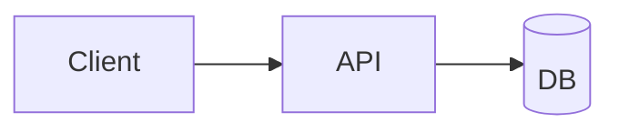

# Architecture — <Project Name>

How the product is built. High-level enough to stay true; link to code for detail.
`architect-agent` RECORDs here after every verified structural change.

## Stack

- **Language / runtime:** <lang@version>
- **Framework:** <framework>
- **Datastore:** <engine>
- **Hosting / infra:** <where it runs>

## Module map

| Dir | Owns | Entry point |
|---|---|---|
| `<backend-dir>/routes/` | HTTP layer only — parse → service → envelope | `<file>` |
| `<backend-dir>/services/` | Business logic: rules, calculations, workflows | `<file>` |
| `<frontend-dir>/components/` | Product UI composed from primitives | `<file>` |
| `<shared-dir>/` | Cross-cutting types/utils used by ≥2 areas | `<file>` |

## Where new code goes

- New endpoint → `<backend-dir>/routes/` (thin) with logic in `services/`. Canonical pattern: `<file:line>`.
- New UI → `<frontend-dir>/components/`; a shared component only at the third consumer — copy twice first.
- Needed by ≥2 areas → `<shared-dir>/` — types and utils only, never app logic.

## Boundaries

What never imports what. `code-reviewer` reads THIS section; a violation is a review blocker.

- `<frontend-dir>` never imports from `<backend-dir>`; shared types live in `<shared-dir>`. (traces to: `<incident>`)
- Only `<data-layer-dir>` touches the DB. (traces to: `<incident>`)
- Verify after any cross-module import: `<boundary-check-cmd>`.

## Data flow

## Integration points

- <external service, API, webhook, or sibling project this depends on or feeds>

## Open questions

- <unresolved design question>
