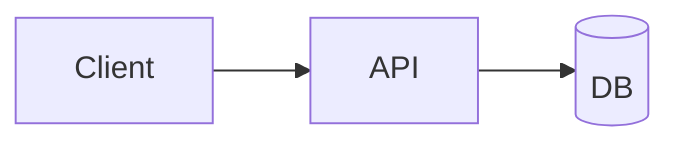

# Architecture — PROJECT NAME

<!-- How the product is built. Keep it high-level enough to stay true; link to code for detail. -->

## Stack

- **Language / runtime:**
- **Framework:**
- **Datastore:**
- **Hosting / infra:**
- **Key dependencies:**

## Key modules

<!-- The map of the terrain: major components and what each owns. -->

| Module | Responsibility | Notes |
|---|---|---|
| | | |

## Data flow

<!-- Optional Mermaid diagram of the main request/data path. -->

## Integration points

<!-- External services, APIs, webhooks, other projects this depends on or feeds. -->

- ...

## Open questions

- ...
